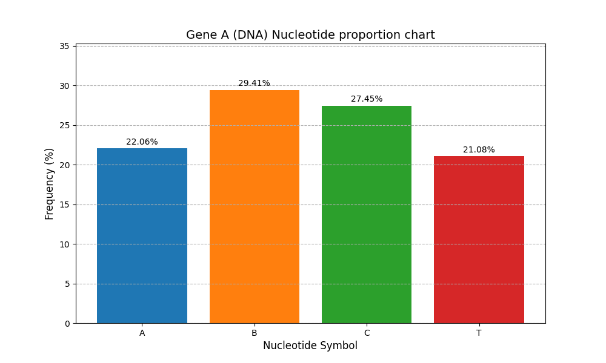
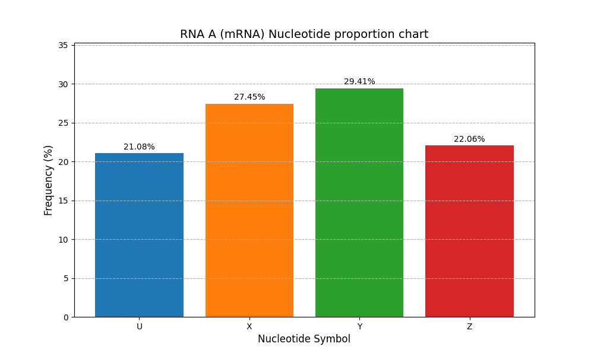

# 🧬 Martian Genome Decoder

> Reverse-engineering an alien genetic code from raw sequence data — with no
> prior knowledge of its nucleotides, base-pairing rules, or codon structure.


---

## Overview

Earth's genetic code is well understood: four DNA bases (A, T, C, G), a fixed
complementary pairing, and triplet codons. A newly discovered **Martian
species does not follow any of these rules** — different nucleotides, an
unknown transcription mapping, and a different codon length.

This project decodes that genetic language from scratch. Using a fully
documented reference gene (**Gene A**) as a Rosetta Stone, it derives the
Martian rules statistically and algorithmically, then applies them to
transcribe and translate a previously unreadable gene (**Gene B**) into its
mRNA and protein sequences.

## The Challenge

Standard bioinformatics tooling assumes the Earth genetic code, so none of it
applies here. Three unknowns had to be solved purely from the data:

| Unknown | Approach |
| :--- | :--- |
| **Which nucleotides exist?** | Discover the alphabet dynamically by scanning the sequences. |
| **How does DNA map to RNA?** | Align DNA and RNA, count base pairs, and derive the mapping by frequency. |
| **How long is a codon?** | Solve it arithmetically from the mRNA-to-protein length ratio. |

## How It Works — the Pipeline

The analysis is a five-stage pipeline; each stage is an independent,
importable module in [`src/`](src/).

| Stage | Module | What it does |
| :---: | :--- | :--- |
| 1 | `sequence_analysis.py` | Cleans raw sequences, discovers the nucleotide alphabet, and plots base-frequency charts. |
| 2 | `transcription_decoder.py` | Aligns DNA to RNA with a sliding window and derives a **bijective transcription key**. |
| 3 | `codon_length.py` | Derives the codon length from the mRNA-to-protein length ratio. |
| 4 | `codon_table.py` | Builds the codon → amino-acid lookup table. |
| 5 | `decode_gene_b.py` | **Entry point.** Learns the rules from Gene A and decodes the unknown Gene B. |

## Key Results

The pipeline successfully cracked the Martian genetic code:

- **DNA alphabet:** `A, T, C, B` — note **G is absent**, and a novel base `B` appears.
- **RNA alphabet:** `U, X, Y, Z`.
- **Transcription key:** `A → Z`, `B → Y`, `C → X`, `T → U` — a perfect **100 % one-to-one mapping**.
- **Codon length:** **2** (a doublet codon — Earth uses triplets).
- **Gene B decoded:** successfully transcribed to mRNA and translated to a 102-residue protein.

### Codon → Amino-Acid Table (Gene A)

| Codon | Element | Codon | Element |
| :---: | :---: | :---: | :---: |
| UU | As | YU | Cl |
| ZX | Be | UX | K  |
| XU | N  | YX | Rn |
| XX | S  | XY | Al |
| UZ | Mg | UY | Na |
| ZU | Ni | XZ | C  |
| ZY | Li | YZ | Ar |
| YY | Pb | ZZ | Zn |

### Earth vs. Mars

| Feature | Earth | Mars |
| :--- | :--- | :--- |
| DNA bases | A, T, C, G | A, T, C, **B** |
| RNA bases | A, U, C, G | U, X, Y, Z |
| Codon length | 3 (triplet) | 2 (doublet) |
| Possible codons | 4³ = 64 | 4² = 16 |
| Codon degeneracy | High | Low |

<details>
<summary><b>Decoded Gene B protein sequence</b> (click to expand)</summary>

```
AsArAlKNaClNBeBeRnClNaArKNiPbBeSRnNaArPbMgLiNiLiArClAlMgRnArCNCl
PbNKAlNLiNaClSNaSRnSNaKBeLiPbKMgNCArMgKRnAlNaAlNNClCKNiRnNSAlLi
ClMgAlPbNiNAlMgNaKCCPbNaArSAlArNNaCCKArNaClZn
```
</details>

## Visualizations

Nucleotide frequency distributions for the reference Gene A, generated by
Stage 1:

| Gene A — DNA | RNA A — mRNA |
| :---: | :---: |
|  |  |

The matching profiles (≈29 % / 27 % / 22 % / 21 %) are the first clue that the
DNA → RNA mapping is strictly one-to-one.

## Tech Stack

- **Language:** Python 3
- **Libraries:** `matplotlib` (visualization); `re` and `collections` (standard library)
- **Techniques:** dynamic alphabet discovery, sliding-window sequence alignment,
  frequency-ratio analysis, bijection validation, arithmetic codon inference

## Project Structure

```
Martian-creatures-Genetic-Analysis/
├── src/                      # Analysis pipeline
│   ├── sequence_analysis.py      # Stage 1 — quantify & visualize
│   ├── transcription_decoder.py  # Stage 2 — derive transcription key
│   ├── codon_length.py           # Stage 3 — derive codon length
│   ├── codon_table.py            # Stage 4 — build codon table
│   └── decode_gene_b.py          # Stage 5 — decode Gene B (entry point)
├── data/                     # Input FASTA sequences
├── results/                  # Generated distribution charts
├── docs/                     # Detailed analysis report (PDF)
├── requirements.txt
└── README.md
```

## Getting Started

```bash
# 1. Clone the repository
git clone https://github.com/weizirou6688-del/Martian-creatures-Genetic-Analysis.git
cd Martian-creatures-Genetic-Analysis

# 2. Install dependencies
pip install -r requirements.txt

# 3. Run the full pipeline (decode Gene B)
python src/decode_gene_b.py

# Optional: regenerate the nucleotide distribution charts
python src/sequence_analysis.py
```

Each stage can also be run on its own, e.g. `python src/transcription_decoder.py`.

## Full Report

A detailed write-up — methodology, challenges, biological discussion, and an
Earth-vs-Mars comparison — is available in
[`docs/bioinformatic_report.pdf`](docs/bioinformatic_report.pdf).

## Author

**Ava Wei** · [GitHub](https://github.com/weizirou6688-del)

Developed as part of the *CS31420 Computational Bioinformatics* module.

## License

Released under the [MIT License](LICENSE).
